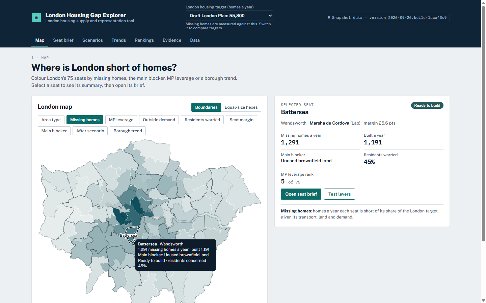
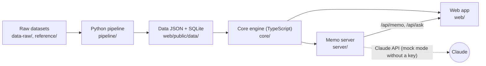
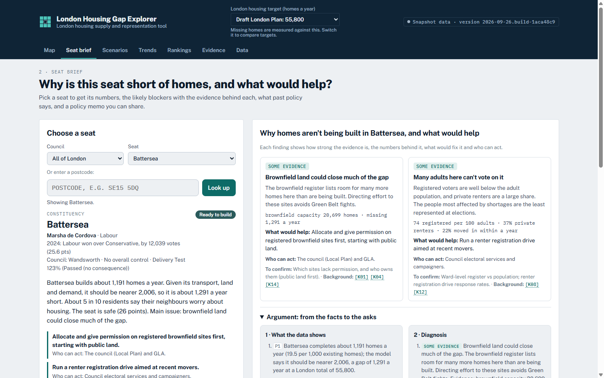
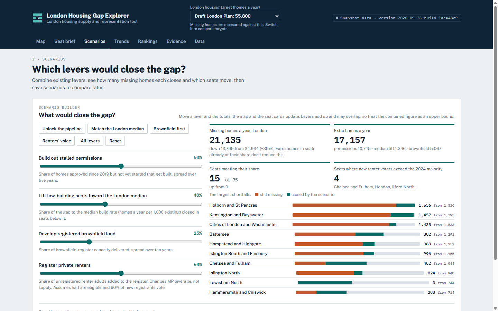
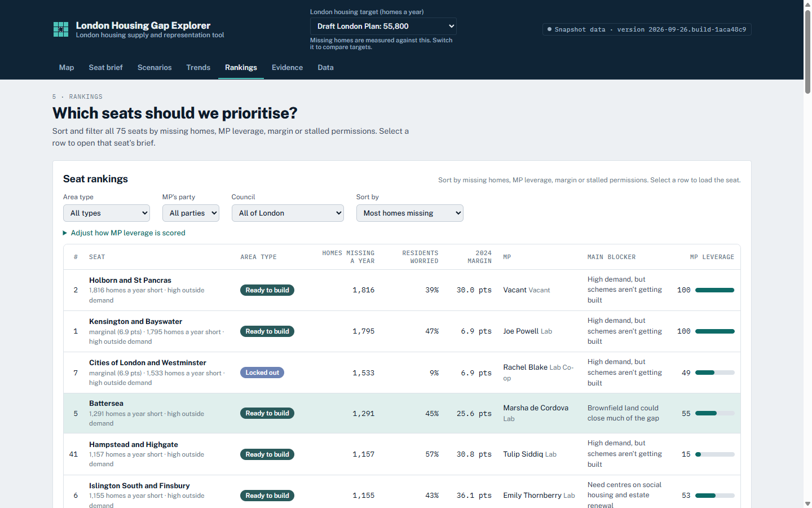

# London Housing Gap Explorer

**The demand that can't vote: where London is short of homes, why, and what would help, for each of its 75 parliamentary seats.**



## At a glance

| | |
|---|---|
| **What** | An interactive map and policy tool. For each London seat it separates outside (market) demand from residents' (voter) concern, estimates missing homes a year, diagnoses the likely blocker and scores policies for fit and risk |
| **For** | Campaigners, council officers and MPs' teams who need a seat-level case for more homes |
| **Built with** | TypeScript (Vite web app, Node memo server, shared engine), Python data pipeline, Claude for policy memos |
| **Status** | Hackathon prototype on a data snapshot of 26 Sep 2026. Runs locally; tests pass. Not deployed |

## The problem

The people who most need homes in an area (renters, movers, people priced out) often don't vote there. The people who do vote there feel the shortage least. Local politics follows voters, so building follows voter sentiment rather than demand. This tool shows that gap seat by seat and turns it into something a campaigner or MP's team can act on.

## How it works



1. **Tag every indicator as market-side or voter-side** (`pipeline/indicators.py`; [demand taxonomy](docs/demand_taxonomy.md), [step 1](docs/step_1_market_vs_voter.md)). Market = would-be residents' behaviour (demand, prices). Voter = current residents' opinion or electoral weight. Tenure and age explain voter demand but stay off the voter axis; homes built or refused are outcomes.
2. **Measure voter–market disagreement.** Market = WhereToBuild housing gap per 1,000 residents; voter = share of residents who say neighbours worry about housing. Both are ranked across the 75 seats and the pair of ranks places each seat in a 3×3 grid (`core/src/compute.ts`, `core/src/classify.ts`). **Locked out** and **Worried, no market** are the seats where the two sides disagree.
3. **Estimate missing homes.** A quantile regression over 1,002 neighbourhoods (MSOAs) of building rates on transport access and brownfield capacity gives each area a potential; London's target is shared out in proportion and compared with completions (`core/src/missing.ts`, `pipeline/model.py`).
4. **Suggest policies.** Rules diagnose the likely blocker (`core/src/hypotheses.ts`); each policy is scored for fit and risk from the seat's data, next to what past evaluations found it delivered (`core/src/policyfit.ts`). The memo server turns this into a cited brief.

The indicator split, the disagreement measure and evidence-weighted policy scoring are Keval's model design. Keval's voter–market distance metric (over sets of indicators) is designed but not implemented: the current build uses one headline indicator per side. Full formulas: [formal model](docs/08_formal_model.md), [algorithm specification](docs/05_algorithm_specification.md). All findings are associations across 75 seats, not causal estimates.

## Features

| Seat brief | Scenarios | Rankings |
|---|---|---|
| [](docs/images/seat.png) | [](docs/images/scenarios.png) | [](docs/images/rankings.png) |
| Blockers with evidence, suggested policies, a streamed policy memo and PDF export | Combine levers (stalled permissions, median build rate, brownfield, renter registration) and see the gap close | Sort and filter all 75 seats by missing homes, MP leverage, margin or stalled permissions |

Also: postcode lookup, boundary or equal-size hex map with nine colourings, borough trends over time, a rated policy evidence page, and a data page.

## Quick start

Needs Node 24 and Python 3.14 (versions tested).

```bash
npm ci
npm run dev        # website on http://localhost:5173
npm run server     # optional, second terminal: memo API on :8787
```

The built data is committed, so no pipeline run is needed. The memo server runs in mock mode unless `ANTHROPIC_API_KEY` is set in `server/.env` (copy `server/.env.example`); see [server/README.md](server/README.md).

To rebuild the data: `pip install -r pipeline/requirements.txt && npm run data`.

## Project structure

```
pipeline/        Python: ingest, clean, model, export -> web/public/data/*.json + SQLite
core/            TypeScript engine: classification, missing homes, blockers, policy fit, scenarios, prompts
web/             Vite + TypeScript site (map, seat brief, scenarios, trends, rankings, evidence)
  public/data/   Built data the site and server read
  e2e/           Playwright browser tests
server/          Node API streaming policy memos from Claude
docs/            Product, functional, data and algorithm specs (01-10), demand taxonomy, demo script
data-raw/        Datasets collated by Shivam (shiv/) and Manuel (manuel/)
tools/turingdb/  Loads London Datastore extracts into a TuringDB graph
reference/       The original single-file prototype; the pipeline reads seed values from it
```

## Data sources and licences

The code is MIT-licensed ([LICENSE](LICENSE)). Each data source keeps its own licence and terms.

| Data | Source | Notes |
|---|---|---|
| Housing demand gap | [WhereToBuild](https://wheretobuild.warwick.ac.uk/), University of Warwick | **Event use only.** Raw neighbourhood data is not in this repo; only seat-level summaries |
| Resident concern about housing | Prime Radiant MRP (17 Aug 2026 wave) via the Forest research connector | 51 seats measured, 24 estimated by regression. Redistribution terms to be confirmed |
| Price/earnings, price change, election results, MPs | House of Commons Library; mySociety | |
| Completions, pipeline, lapsed and refused schemes | [Planning London Datahub](https://www.planningdata.london.gov.uk/) | Misses some homes in a few boroughs |
| Census 2021 tenure and mobility | ONS via Nomis | |
| PTAL, prices, rents, affordability, rough sleeping | TfL, HM Land Registry, GLA via London Datastore | |
| Brownfield land | [planning.data.gov.uk](https://www.planning.data.gov.uk/dataset/brownfield-land) | |
| Boundaries, lookups, hex map | mySociety 2025 constituencies; drkane/geo-lookups; ODI Leeds hexmaps | |
| Policy evidence | English Housing Survey and six published evaluations (`data-raw/manuel/`) | |

## Testing

```bash
npm test                                           # core + server (vitest) + pipeline (pytest)
npx playwright install chromium && npm run e2e     # browser tests
```

Last run (26 Sep 2026): core 28 passed, server 13 passed, pipeline 10 passed, end-to-end 14 passed.

## Limitations

- 24 of 75 seats use estimated resident concern rather than polled values.
- WhereToBuild neighbourhood data could not be used directly, so neighbourhood potential is split from seat totals by transport access and brownfield capacity.
- Each side of the voter–market gap uses one headline indicator; the multi-indicator distance is not built yet.
- Data is a snapshot; nothing refreshes automatically.

## Team

Built at **House London #2 Data Hackathon, Newspeak House, 26 Sep 2026**.

| Who | Role |
|---|---|
| Keval Patel ([@KPS25FX](https://github.com/KPS25FX)) | Software engineering and modelling: voter-vs-market indicator model, disagreement measure, policy scoring; wrote the functional specifications |
| Shivam Gujral ([@shivam9111](https://github.com/shivam9111)) | Data collation and housing domain analysis; market/voter demand taxonomy |
| Manuel ([@2015mmarchetti-sudo](https://github.com/2015mmarchetti-sudo)) | Data collation and housing domain analysis; policy evidence base; TuringDB graph |

Code largely generated with Claude Code from functional specifications written by Keval.
