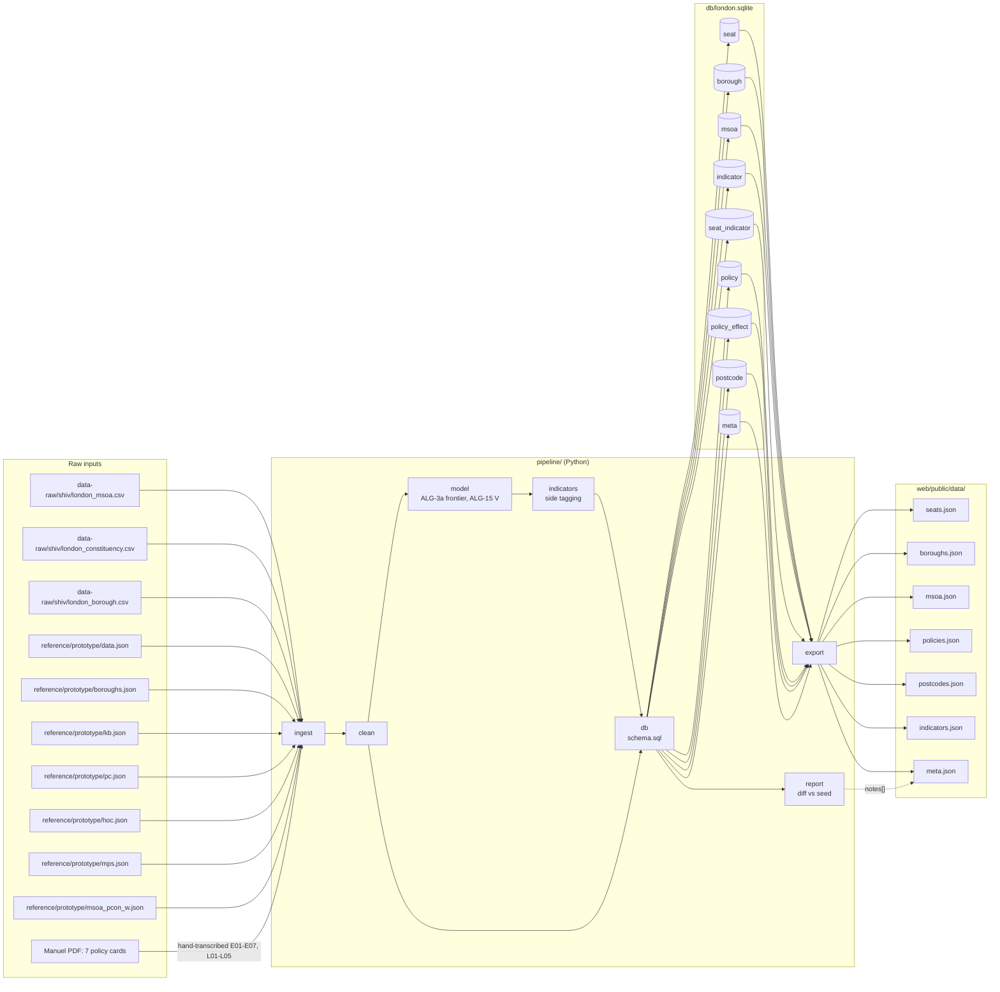
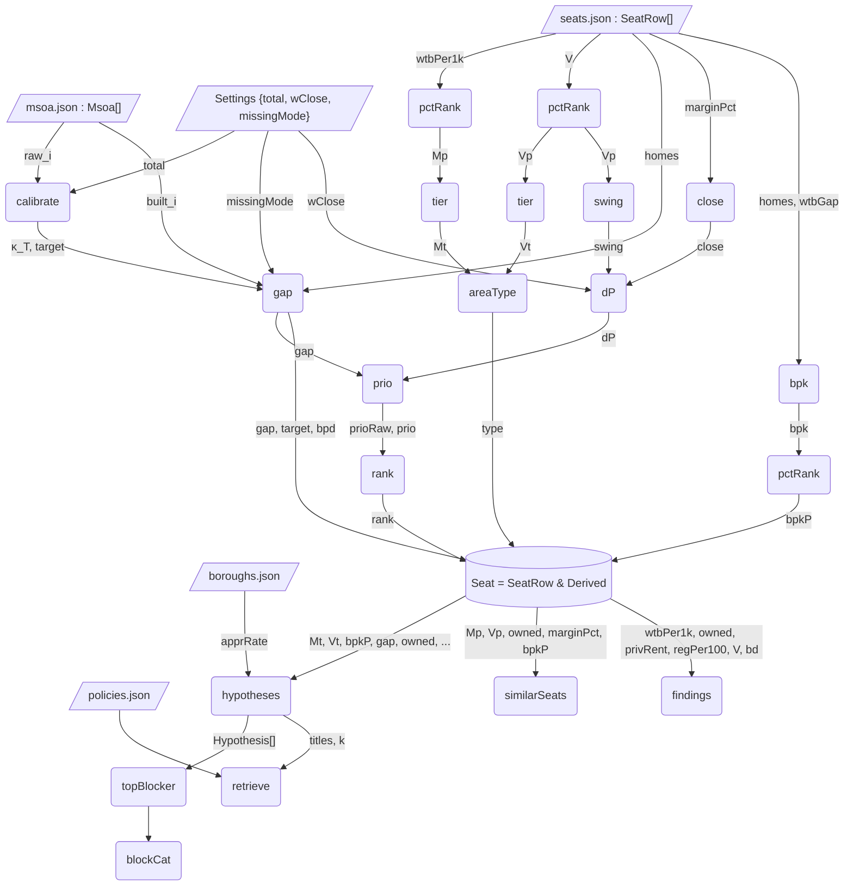
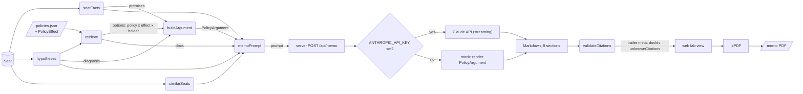
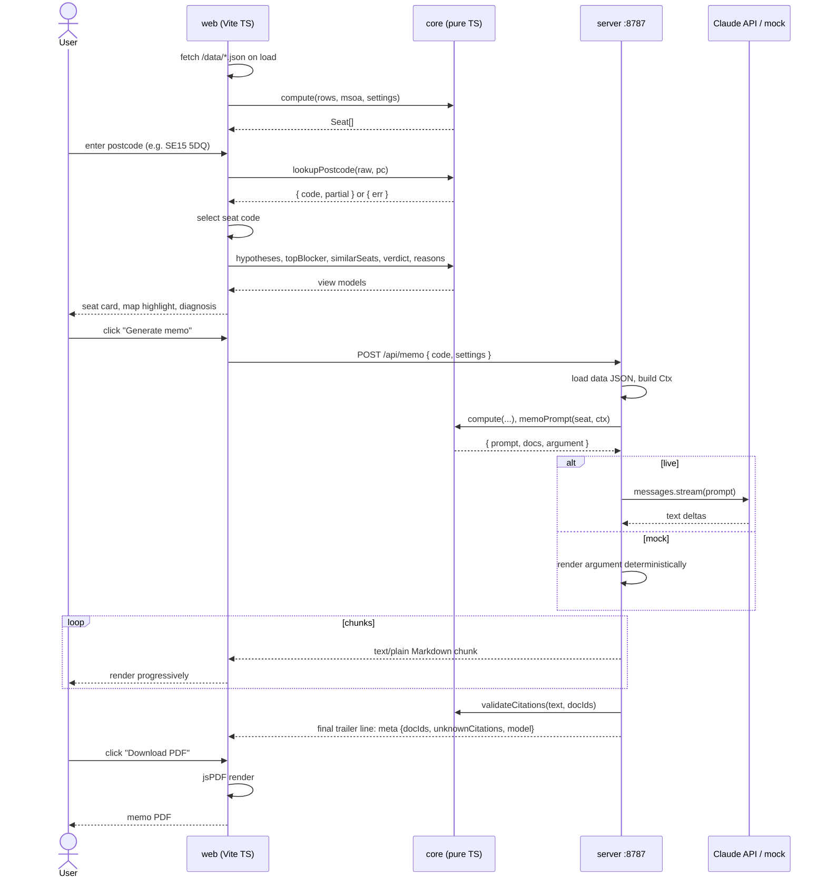
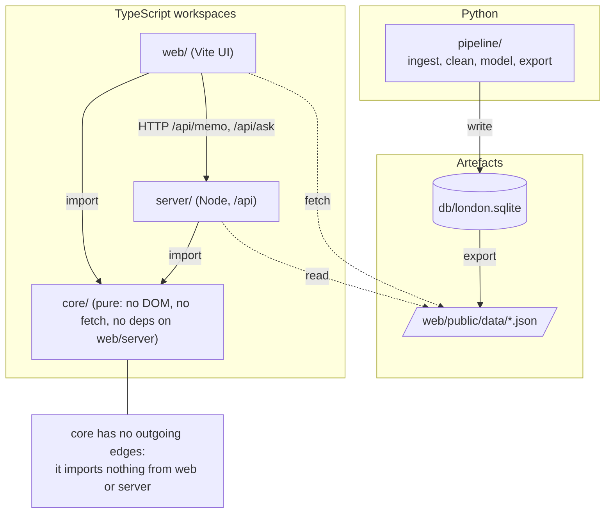

# 09 Pipeline graphs

Mermaid diagrams of the system's inputs, computations and request flows. Names follow [10_interfaces.md](10_interfaces.md) and the maths in [08_formal_model.md](08_formal_model.md). The diagrams render in GitHub and in the VS Code Markdown preview (Mermaid extension).

## 1. Data lineage: raw inputs → pipeline → SQLite → JSON

Source priority: Shiv's CSVs are primary for recomputable fields. The prototype JSON seeds `V`, `vEst`, `wtbGap`, `wtbPer1k`, `afford`, `hpg5`, elections, MPs, `q`/`r` and `raw`/`tops`. `msoa_pcon_w.json` feeds the per-neighbourhood fallback (`meta.missingMode = 'msoa_fallback'`).

## 2. Compute DAG (core, per `compute()` call and downstream)

Nodes are values and edge labels are the fields that flow along them. Rounded nodes are core functions.

## 3. Policy memo chain

## 4. Request sequence: postcode to PDF

## 5. Module dependency graph

Only `web` and `server` import `core`. `core` has no runtime dependencies on either, and it reads data only through arguments. The pipeline shares nothing with the TS code except the JSON contract in docs/10 §1.

## 6. Typed input → output table (core API)

| Function | Inputs | Output | ALG |
|---|---|---|---|
| `compute` | `rows: SeatRow[]`, `msoa: Msoa[]`, `settings: Settings` | `Seat[]` | 1–5 |
| `pctRank` *(internal)* | `sorted: number[]`, `v: number` | `number ∈ (0,1)` | 1 |
| `tier` *(internal)* | `p: number` | `Tier` | 2 |
| `areaType` *(internal)* | `Mt: Tier`, `Vt: Tier` | `AreaType` | 2 |
| `calibrate` *(internal)* | `rows: SeatRow[]`, `total: number` | `number` (κ_T) | 3b |
| `hypotheses` | `s: Seat`, `ctx: Ctx` | `Hypothesis[]` (sorted by `s` desc) | 7 |
| `topBlocker` | `s: Seat`, `ctx: Ctx` | `Hypothesis \| null` | 8 |
| `blockCat` | `s: Seat`, `ctx: Ctx` | `BlockerCat` | 8 |
| `similarSeats` | `s: Seat`, `seats: Seat[]`, `n = 3` | `Seat[]` | 9 |
| `retrieve` | `s: Seat`, `H: Hypothesis[]`, `policies: Policy[]` | `Policy[]` (≤ 12) | 10 |
| `seatFacts` | `s: Seat`, `ctx: Ctx` | `Record<string, unknown>` | 10 |
| `buildArgument` | `s: Seat`, `ctx: Ctx` | `PolicyArgument` | policy/argument.ts |
| `memoPrompt` | `s: Seat`, `ctx: Ctx` | `{ prompt: string; docs: Policy[]; argument: PolicyArgument }` | 10 |
| `askPrompt` | `s: Seat`, `ctx: Ctx`, `earlierMemo: string`, `question: string` | `string` | F11 |
| `lookupPostcode` | `raw: string`, `pc: Postcodes` | `{ code; partial } \| { err }` | 11 |
| `verdict` | `s: Seat`, `ctx: Ctx` | `string` | 12 |
| `reasons` | `s: Seat` | `string[]` (≤ 3) | 13 |
| `findings` | `seats: Seat[]` | `Finding[]` | 14 |
| `spearman` | `x: number[]`, `y: number[]` | `number ∈ [-1,1]` | 14 |
| `validateCitations` | `text: string`, `allowedIds: string[]` | `{ unknown: string[] }` | 10 |
